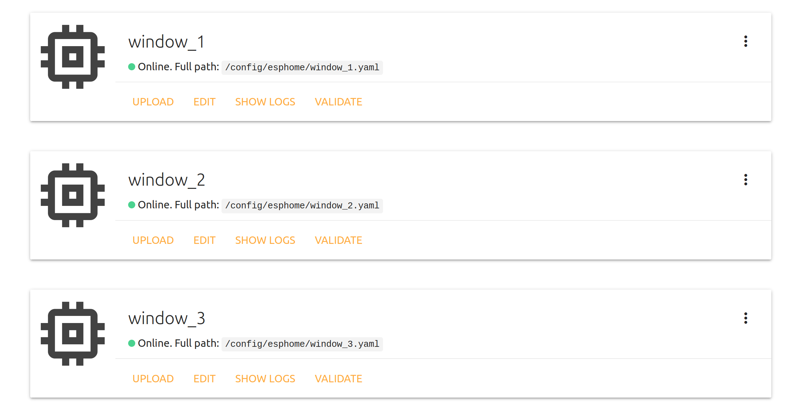

# Автоматизация дешевых жалюзи  

Для этого проекта выбрал ESP8266 с прошивкой, которую можно добавить в Home Assistant за один клин. Без использования MQTT.

Read this in other languages: [English](README.md), [Русский язык](README.ru.md).

__________

## Содержание
- [Материалы](https://github.com/empenoso/diy-cheap-automated-blinds/blob/master/README.ru.md#%D0%BC%D0%B0%D1%82%D0%B5%D1%80%D0%B8%D0%B0%D0%BB%D1%8B-top)
- [Прошивка ESPHome для ESP8266, которая управляет моторчиком в жалюзи](https://github.com/empenoso/diy-cheap-automated-blinds/blob/master/README.ru.md#%D0%BF%D1%80%D0%BE%D1%88%D0%B8%D0%B2%D0%BA%D0%B0-esphome-%D0%B4%D0%BB%D1%8F-esp8266-%D0%BA%D0%BE%D1%82%D0%BE%D1%80%D0%B0%D1%8F-%D1%83%D0%BF%D1%80%D0%B0%D0%B2%D0%BB%D1%8F%D0%B5%D1%82-%D0%BC%D0%BE%D1%82%D0%BE%D1%80%D1%87%D0%B8%D0%BA%D0%BE%D0%BC-%D0%B2-%D0%B6%D0%B0%D0%BB%D1%8E%D0%B7%D0%B8-top)
- [Правила для автоматизации закрытия жалюзи из Home Assistant](https://github.com/empenoso/diy-cheap-automated-blinds/blob/master/README.ru.md#%D0%BF%D1%80%D0%B0%D0%B2%D0%B8%D0%BB%D0%B0-%D0%B4%D0%BB%D1%8F-%D0%B0%D0%B2%D1%82%D0%BE%D0%BC%D0%B0%D1%82%D0%B8%D0%B7%D0%B0%D1%86%D0%B8%D0%B8-%D0%B7%D0%B0%D0%BA%D1%80%D1%8B%D1%82%D0%B8%D1%8F-%D0%B6%D0%B0%D0%BB%D1%8E%D0%B7%D0%B8-%D0%B8%D0%B7-home-assistant-top)
- [Фотографии](https://github.com/empenoso/diy-cheap-automated-blinds/blob/master/README.ru.md#%D1%84%D0%BE%D1%82%D0%BE%D0%B3%D1%80%D0%B0%D1%84%D0%B8%D0%B8-top)
- [Преимущества и недостатки](https://github.com/empenoso/diy-cheap-automated-blinds/blob/master/README.ru.md#%D0%BF%D1%80%D0%B5%D0%B8%D0%BC%D1%83%D1%89%D0%B5%D1%81%D1%82%D0%B2%D0%B0-%D0%B8-%D0%BD%D0%B5%D0%B4%D0%BE%D1%81%D1%82%D0%B0%D1%82%D0%BA%D0%B8-top)

## Материалы [:top:](https://github.com/empenoso/diy-cheap-automated-blinds/blob/master/README.ru.md#%D0%B0%D0%B2%D1%82%D0%BE%D0%BC%D0%B0%D1%82%D0%B8%D0%B7%D0%B0%D1%86%D0%B8%D1%8F-%D0%B4%D0%B5%D1%88%D0%B5%D0%B2%D1%8B%D1%85-%D0%B6%D0%B0%D0%BB%D1%8E%D0%B7%D0%B8--)
1. [Леруа Мерлен жалюзи Inspire 100х160 см алюминий цвет белый](https://perm.leroymerlin.ru/product/zhalyuzi-inspire-100h160-sm-alyuminiy-cvet-belyy-16262144/) * 3 штуки

2. [Шаговый двигатель 28BYJ-48 5V 4 Phase DC Gear Stepper Motor + ULN2003 Driver Board](https://www.aliexpress.com/item/32896006818.html) * 3 штуки

3. [Плата LOLIN D1 mini V3.1.0 - WEMOS WIFI Internet of Things development board based ESP8266](https://www.aliexpress.com/item/32529101036.html) * 3 штуки

4. [Блок питания AC-DC 100-240V To 5V 2.5A Switching Power Supply Module](https://www.aliexpress.com/item/32898716031.html) * 1 штука

5. [3mm-5mm соединительная втулка](https://www.aliexpress.com/item/33015747654.html) * 3 штуки (Спасибо [@KennethLavrsen](https://github.com/KennethLavrsen)  за совет)

## Прошивка [ESPHome](https://esphome.io/components/stepper/index.html) для ESP8266, которая управляет моторчиком в жалюзи [:top:](https://github.com/empenoso/diy-cheap-automated-blinds/blob/master/README.ru.md#%D0%B0%D0%B2%D1%82%D0%BE%D0%BC%D0%B0%D1%82%D0%B8%D0%B7%D0%B0%D1%86%D0%B8%D1%8F-%D0%B4%D0%B5%D1%88%D0%B5%D0%B2%D1%8B%D1%85-%D0%B6%D0%B0%D0%BB%D1%8E%D0%B7%D0%B8--)
 
Я использую [дополнение для ESPHome Hass.io](https://github.com/esphome/hassio) для компиляции следующих файлов:
- [window_1.yaml](window_1.yaml)
- [window_2.yaml](window_2.yaml)
- [window_3.yaml](window_3.yaml)

## Правила для автоматизации закрытия жалюзи из [Home Assistant](https://www.home-assistant.io/docs/automation/) [:top:](https://github.com/empenoso/diy-cheap-automated-blinds/blob/master/README.ru.md#%D0%B0%D0%B2%D1%82%D0%BE%D0%BC%D0%B0%D1%82%D0%B8%D0%B7%D0%B0%D1%86%D0%B8%D1%8F-%D0%B4%D0%B5%D1%88%D0%B5%D0%B2%D1%8B%D1%85-%D0%B6%D0%B0%D0%BB%D1%8E%D0%B7%D0%B8--)

При превышении определенного порога жалюзи [поворачиваются на 90 градусов](automations.yaml) и потом обратно соответственно.

## Фотографии [:top:](https://github.com/empenoso/diy-cheap-automated-blinds/blob/master/README.ru.md#%D0%B0%D0%B2%D1%82%D0%BE%D0%BC%D0%B0%D1%82%D0%B8%D0%B7%D0%B0%D1%86%D0%B8%D1%8F-%D0%B4%D0%B5%D1%88%D0%B5%D0%B2%D1%8B%D1%85-%D0%B6%D0%B0%D0%BB%D1%8E%D0%B7%D0%B8--)

_____

## Преимущества и недостатки [:top:](https://github.com/empenoso/diy-cheap-automated-blinds/blob/master/README.ru.md#%D0%B0%D0%B2%D1%82%D0%BE%D0%BC%D0%B0%D1%82%D0%B8%D0%B7%D0%B0%D1%86%D0%B8%D1%8F-%D0%B4%D0%B5%D1%88%D0%B5%D0%B2%D1%8B%D1%85-%D0%B6%D0%B0%D0%BB%D1%8E%D0%B7%D0%B8--)
+ Дешево.
- ESP8266 никогда не знает текущего положения жалюзи. Иногда, когда например вал прокручивается, приходится вручную подгонять под начальное положение нажатием кнопки в интерфейсе Home Assistant.

## Подробности [:top:](https://github.com/empenoso/diy-cheap-automated-blinds/blob/master/README.ru.md#%D0%B0%D0%B2%D1%82%D0%BE%D0%BC%D0%B0%D1%82%D0%B8%D0%B7%D0%B0%D1%86%D0%B8%D1%8F-%D0%B4%D0%B5%D1%88%D0%B5%D0%B2%D1%8B%D1%85-%D0%B6%D0%B0%D0%BB%D1%8E%D0%B7%D0%B8--)

Дополнительная информация [в статье на сайте](https://habr.com/ru/post/480690/).

